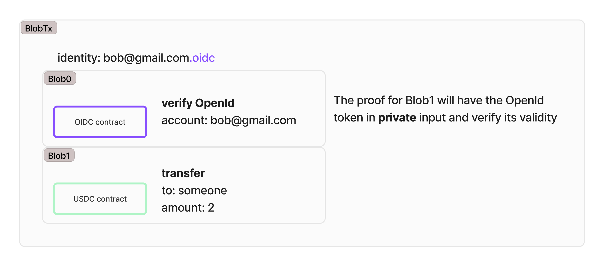

# Identity management

Identity [in traditional blockchains](./hyli-vs-vintage-blockchains.md) is typically tied to a single wallet address. This approach limits flexibility and compromises privacy.

On Hyli, **any app can be a proof of identity**. This enables you to register your preferred identity source as an app for authentication.

## How Hyli processes identity proofs

A blob transaction on Hyli includes multiple blobs. One of these blobs must contain an identity claim. (If this isn't clear, read more on [our transactions concept page](./transaction.md).)

- Each blob transaction has a single identity blob.
- All provable blobs within a transaction share the same identity.
- Identity proofs include a nonce to prevent replay attacks.
- The proof verification process ensures the identity was correctly provided.

## Choosing an identity source

When selecting an identity contract, remember:

- Identity contracts define how identity proofs are verified.
- Applications decide which identity they support. Some may enforce a specific identity type (e.g., Google accounts), while others allow multiple sources.
- Transactions can transfer Hyli tokens between different identity types, such as from a Metamask wallet to an email/password-based account.
- Users authenticate with any proof supported by their application. There are no "Hyli wallets".

The identity provider should sign the entire blob transaction to ensure that all the included blobs have been approved by the user. One approach is to make the user sign the blobs they agree to execute. The identity contract then verifies that all blobs in the transaction are properly signed.

If you don't want to create a custom identity source for early development, Hyli provides [a native `hydentity` contract](https://github.com/hyli-org/hyli/tree/main/crates/contracts/hydentity). This contract is not secure and must not be used in production.

## Identity verification methods

Hyli supports multiple identity verification methods, each with unique characteristics. Here are some of the most common.

### Private password

A user authenticates using a private password known only to them.

- Password: private input.
- Proof: only those who know the password can generate a valid proof for these blobs.
- The proof is valid only for the blobs in this blob transaction.

### Public signature

A user signs a message with their private key to prove identity.

- Signature: public input. No private input is required, since only the owner of the private key can generate a valid signature.
- Proof: anyone can generate a proof based on the public signature.

![In this graph, the blob transaction has 0xcafe.ecdsa as an identity. The ECDSA contract in blob0 has the action verify signature. The signature is `sign(hash([blob1])`. There is no private input required, anyone can generate a proof but only the owner of the private key can generate a valid signature.)](../assets/img/identity-public-signature.jpg)

### Private OpenID verification

This works just like it does with a private password, except it generally can't be done client-side.

The OpenID provider knows your secret key, so it could be able to generate transactions on  your behalf.

## Custom identity contracts

Applications on Hyli can implement custom identity verification rules through apps. A typical identity contract includes two core functions, as shown in [our identity quickstart](../quickstart/example/custom-identity-contract.md):

- **Register**: Users submit an initial proof of identity.
- **Verify**: The contract validates the proof against predefined rules.

Applications can use this structure or define their own identity workflows as needed.
