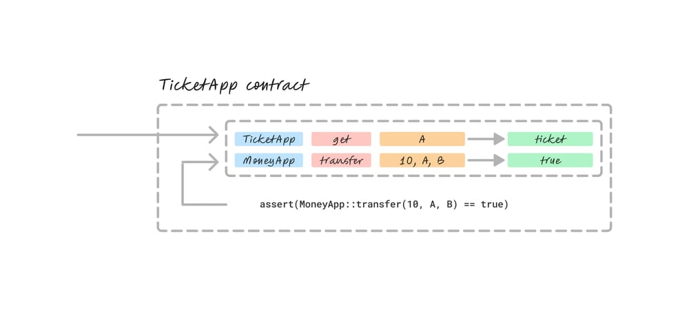

# Proof composition

!!! note
    To understand proof composition in practice, check out [our quickstart example](../quickstart/example/proof-composition.md).

## The problem: clunky interactions

In zero-knowledge systems, interactions between different proofs introduce complexity.

Cross-contract interactions require recursive proof verification, where Program A verifies proof of the correct execution of Program B. This is inefficient and creates overhead at the proof generation and verification stages.

The challenge becomes even greater when you start involving proofs that use different schemes.

Most zero-knowledge systems force you to write your proofs in a unified scheme. By doing that, you lose all the advantages of specialization.

Different proving schemes meet different needs. [Some proof systems are best](./proof-generation.md) for client-side proving; others allow developers to use general-purpose programming languages.

We solve this issue by allowing for native proof composition between contracts and proving schemes. Now, proofs interact seamlessly, and each one can be written in the language that works best.

## The solution: proof composition

### Cross-contract calls with proof composition

**Proof composability** means that Hylé enables these interactions while keeping each proof independent; **proof composition** is the action enabled by composability.

Hylé gets rid of recursion by allowing Program A to specify: "This only applies if all blobs in this operation are valid". At settlement, both proofs are included in the same proof transaction. Hylé verifies them together, and the entire operation fails if any proof fails.

This solution improves developer experience, lowers gas costs, and shortens proving time.

### Proofs using different schemes

Since proofs in Hylé remain independent, you can batch multiple proofs within a single transaction, each using its optimal proving scheme.

Proofs are verified separately, eliminating the need to compromise for compatibility. This also enables cross-contract calls between applications using different proof systems.

### When to use proof composition

Proof composition is useful if:

- Your operation involves several apps.
- Your operation involves several proofs written in different languages.
- Your operation involves very different actions and has different optimal languages: you can now afford to use them.

It has no effect if your operation's entire logic is in one single proof.

## Writing a cross-contract call

Your program doesn't need to verify another program’s execution directly. Instead, it references the external contract using a structured claim, such as:

```md
MoneyApp::transfer(10, A, B) == true
TicketApp::get(A) == ticket
```



Each claim consists of:

- The application (MoneyApp, TicketApp)
- The function being called (transfer, get)
- The parameters used
- A result assertion (== true, == ticket)

In our quickstart example, [the source code looks like this](https://github.com/Hyle-org/examples/blob/492501ebe6caad8a0fbe3f286f0f51f0ddca537c/ticket-app/contract/src/lib.rs#L44-L66).

## How Hylé settles multiple proofs

![A ticket purchase process with four key steps. First, a user requests a ticket through the TicketApp, which in turn requests a transaction blob from MoneyApp. The blob includes the transfer details and is sent back to TicketApp for verification. Second, the TicketApp composes a transaction by combining its own blob and the MoneyApp blob, detailing the operation's validity. Third, the composed transaction is sent to Hylé for verification, where the state transition and assertions are confirmed. Finally, after verification, the user pays $10 and receives their ticket.](../assets/img/proof-composition-flow.jpg)

When you submit multiple proofs to Hylé, proof generation can be parallelized.

Thanks to [pipelined proving](./pipelined-proving.md), proof verification is asynchronous. Proving times do not compound since proofs do not depend on each other, allowing proof generation to be parallelized.

As soon as one proof is ready, it can be verified on Hylé, even if the other proofs aren't ready yet.

Once all proofs related to the transaction are verified, the transaction is settled on Hylé. If one proof verification fails, then the entire transaction fails. If a proof times out, the transaction fails when the timeout occurs.
