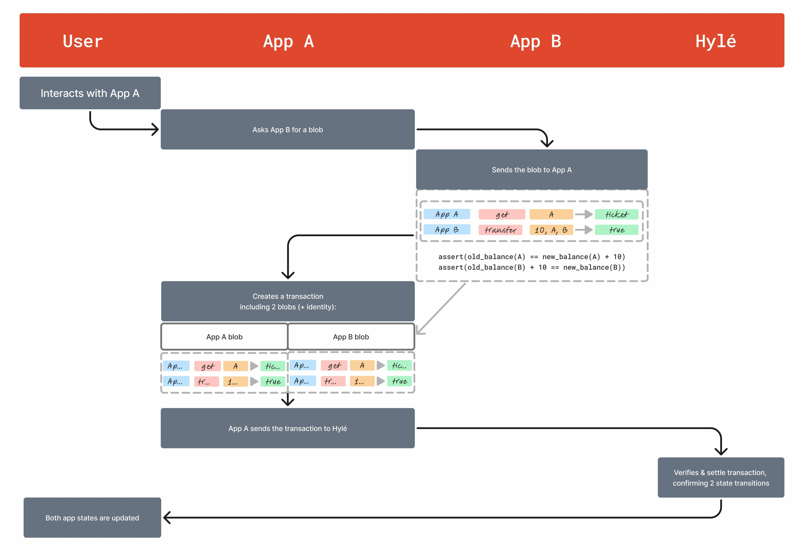

# Proof composition

!!! note
    To understand proof composition in practice, check out [our quickstart example](..//quickstart/proof-composition.md).

## Why proof composition?

### Cross-contract calls with proof composition

In zero-knowledge systems, interactions between different proofs introduce complexity.

In most zero-knowledge systems, cross-contract interactions require recursive proof verification:

- Program A verifies proof of correct execution of Program B;
- Program B verifies proof of correct execution of Program A.

**Proof composability** means that Hylé enables these interactions while keeping each proof independent; **proof composition** is the action enabled by composability.

Hylé gets rid of recursion by allowing Program A to specify: « this only applies if Program B is valid ». At settlement, both proofs are included in the same proof transaction. Hylé verifies them together, and the entire operation fails if any proof fails.

This solution entails an easier developer experience, as well as lower gas costs and a shorter proving time.

### Proofs using different schemes

Since proofs in Hylé remain independent, you can batch multiple proofs within a single transaction, each using its optimal proving scheme.

Proofs are verified separately, eliminating the need to compromise for compatibility. This also enables cross-contract calls between applications using different proof systems.

### When to use proof composition

Proof composition is useful if:

- Your operation involves several apps.
- Your operation involves several proofs written in different languages.
- Your operation involves actions that are very different and have different optimal languages: you can now afford to use them.

It is not useful if your operation's entire logic is in one single proof.

## Writing a cross-contract call

Your program doesn't need to directly verify another program’s execution. Instead, it references the external contract using a structured claim, such as:

```md
MoneyApp::transfer(10, A, B) == true
TicketApp::get(A) == ticket
```


Each claim consists of:

- The application (MoneyApp, TicketApp)
- The function being called (transfer, get)
- The parameters used
- A result assertion (== true, == ticket)

In our quickstart example, [the source code looks like this](https://github.com/Hyle-org/examples/blob/492501ebe6caad8a0fbe3f286f0f51f0ddca537c/ticket-app/contract/src/lib.rs#L44-L66).

## How Hylé settles multiple proofs



When you submit multiple proofs to Hylé, proof generation can be parallelized.

Proof verification is asynchronous thanks to [pipelined proving](./pipelined-proving.md). Proving times do not compound since proofs do not depend on each other, so proof generation can be parallelized.

As soon as one proof is ready, it can be verified on Hylé, even if the other proofs aren't ready yet.

Once all proofs related to the transaction are verified, the transaction is settled on Hylé. If one proof verification fails, then the entire transaction fails. If a proof times out, the transaction fails when the timeout occurs.
