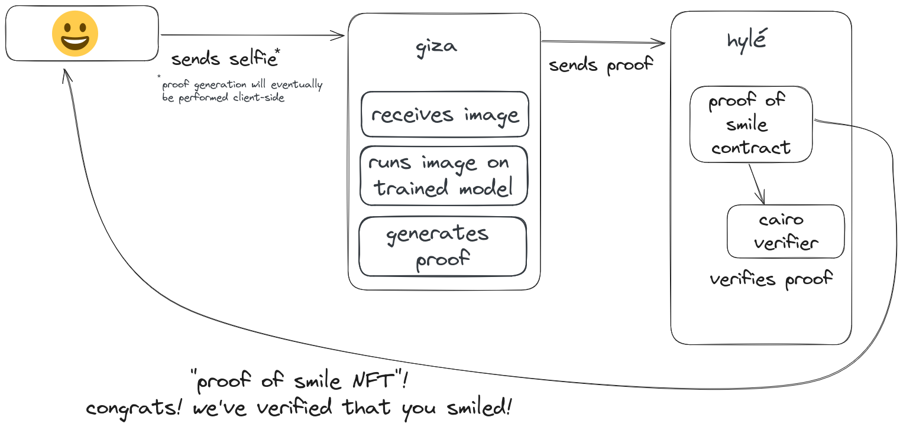

# Vibe Check

The general idea of the Vibe Check app is to give people a SmileToken to reward them for smiling. 

Watch [Sylve's demo at ETHCC[7]](https://ethcc.io/archive/The-rise-of-truthful-applications)!

## Context

The step-by-step process:

1. **I identify myself.**
    1. I use WebAuthn, with a Yubikey on a computer, a fingerprint on a phone, or any other accepted device.
    2. Vibe Check runs the Noir prover in-browser.
    3. The prover generates a Noir proof that the webauthn-signature is correct.
2. **I take a selfie where I’m smiling to generate a proof of my shiny, bubbly personality.**
    1. Vibe Check uses a machine-learning model that the Hylé team has transformed into a Cairo program.
    2. I send my selfie to this Cairo program, which runs on a virtual machine.
    3. The machine-learning model checks that I am smiling.
    4. If I am smiling, the model generates a Cairo-proof. 
3. **Vibe Check gives me a SmileToken.**
    1. Vibe Check locally updates the state of the SmileToken.
    2. Vibe Check generates a Cairo proof that the state transition was done correctly.
4. **Hylé verifies the proofs.**
    1. Hylé updates the SmileToken state if everything is correct. If so, I am rewarded with that SmileToken to congratulate me for my good vibes.
    2. Since Hylé’s state is checkpointed on different networks, I could get that token on any bridged network like Starknet or even Ethereum.

## How it works

### Understanding the components of the demo

The Vibe Check demo consists of three components: the **app**, the **proof generators**, and the **Hylé node**.

The **app** (see [GitHub repository](https://github.com/Hyle-org/vibe-check-frontend)) helps the user craft a transaction through 2 interactions:

- Identification with [WebAuthn](https://vivs.wiki/WebAuthn) for a proof of ID
- Photo of the user smiling for a proof of smile

The **app** sends these inputs to the **proof generators.**

The **proof generators** execute programs and generate proofs.

They can be run locally in the browser or remotely to maximize performance. Local proof generation is possible by compiling the Cairo VM/Cairo Prover/Noir Prover into WASM, but it is inefficient. Proving is a memory-consuming activity, and browsers usually have a low limit.

The proof generators generate three proofs:

1. Proof of ID: verification of the WebAuthn ECDSA signature in Noir
2. Proof of smile: running the machine-learning model in Cairo
3. Token (ERC-20) transfer: initiated in Cairo if the first two proofs are valid.

The **proof generators** send the three proofs to the **app** through one single transaction**.**

The **app** sends that transaction to the **Hylé node**.

The **Hylé node:**

1. Unpacks the three proofs.
2. Verifies each proof with the correct verifier: Noir for WebAuthn and Cairo for the two others.
3. Ensures consistency by checking the public data contained in the proofs to ensure they all relate to the same transaction.

### Multiple proving schemes

A **proving scheme** is a protocol or framework for generating proofs and verifying them.

In Vibe Check, we use Noir and Cairo.

We use **Noir** to generate ECDSA proofs. Its Typescript SDK makes it easy to integrate into an app.

We use **Cairo** for two proofs:

- That there is a smile on the screenshot
- The coin transfer, with an ERC-20 specification.

We used the LambdaClass CairoVM. Because of the current dependency mismatches between the prover and the runner, the Cairo prover and the Cairo runner had to be compiled separately.

See the [Cairo ERC20 runner source code](https://github.com/Hyle-org/cairo-erc20-runner).

### Using Giza for zkML

ZkML is one of ZK's many use cases. It helps you assert that a prediction's result was obtained with the right model, trained on the right dataset, and fed with the right input.

**Giza** focuses on helping developers create a provable machine-learning model.

Here is the flow we followed:

1. We used a **simple classifier from the [XGBoost library](https://xgboost.readthedocs.io/en/stable/) in Python**, which Giza fully supports. 
2. We serialized our model in json thanks to the Giza SDK.
3. We used the Giza API to turn our model into a Cairo program.
4. We compiled the Cairo ML into Sierra using `scarb`
5. We executed our model in the Cairo VM we were using.

Deep learning models, especially CNNs, would typically be more appropriate for image recognition, but some primitives used by those are not yet supported. Larger models are also extremely hard to run in a Cairo VM because of their high memory requirements.

## The actual code

Coming soon!