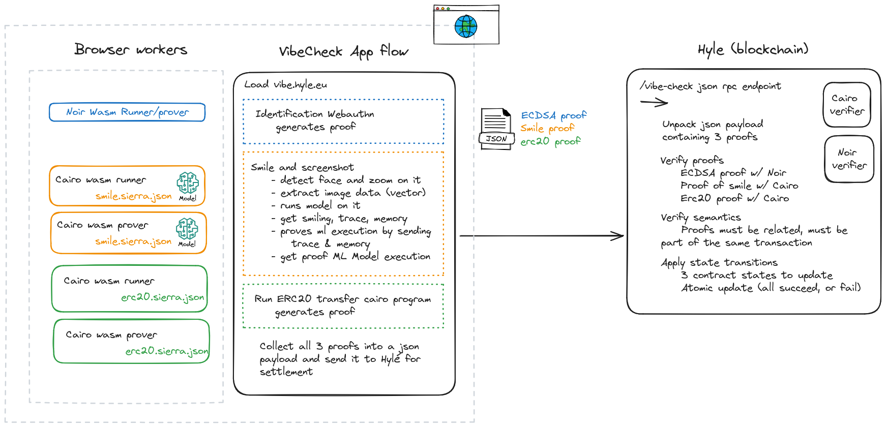

# Vibe Check

✨ Coming soon ✨

## Context

The general idea is to give people « good vibes » NFTs for smiling.

The step-by-step process:

1. a person takes a photo of them smiling to generate a proof of their shiny, bubbly personality.

1. Giza uses a machine-learning model that checks whether they are smiling. If they are, then Giza generates proof of that. This is currently done through Giza’s servers, which requires the user to send out the picture to Giza. We’re hoping that technological advances will soon allow for direct client-side proving.

1. Hylé verifies the proof, and a smart contract awards an NFT to the user to congratulate them for sharing good vibes. Since Hylé’s state is checkpointed on different networks, you could get an NFT on any bridged network, like Hylé itself, Starknet, or even Ethereum.

## Watch it live!
*Clean video to come.*

In the meantime, watch [Sylve's demo at ETHCC[7]](https://ethcc.io/archive/The-rise-of-truthful-applications).