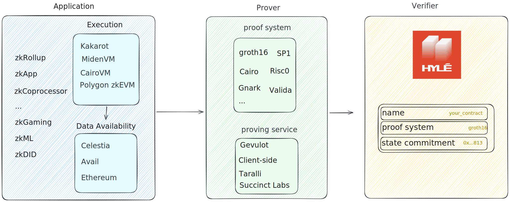

# Welcome to the Hylé developer docs

!!! note
    This developer portal and the project itself are still in early development. See below on how to reach out to us if you need anything that isn't here.

[Hylé](https://www.hyle.eu/) is your minimal layer one, focused only on verifying zero-knowledge proofs.

For more information, [check out our website](https://hyle.eu).

## Getting started

1. Check out how to [install the CLI](getting-started/hyled-install-instructions.md)
1. Learn how to [create your first smart contract](getting-started/your-first-smart-contract.md)

## Our use cases

- [Hylé for ZKApps](use-cases/for-zk-apps.md) 
- [Hylé for identity providers & wallets](use-cases/for-identity-providers.md)
- Hylé for RAAS & ZK Coprocessors (coming soon)
- ...

## Contact us

Feel free to reach out to the team for more information:  

- X [@hyle_org](http://twitter.com/hyle_org)
- Farcaster [@hyle-org](https://warpcast.com/hyle-org)
- Telegram [@hyle_org](https://t.me/hyle_org)
- Mail [contact@hyle.eu](mailto:contact@hyle.eu)

## Useful links

- [Main repository](http://github.com/hyle-org/hyle) (cosmos SDK app)
- [Hylé.eu](https://hyle.eu)
