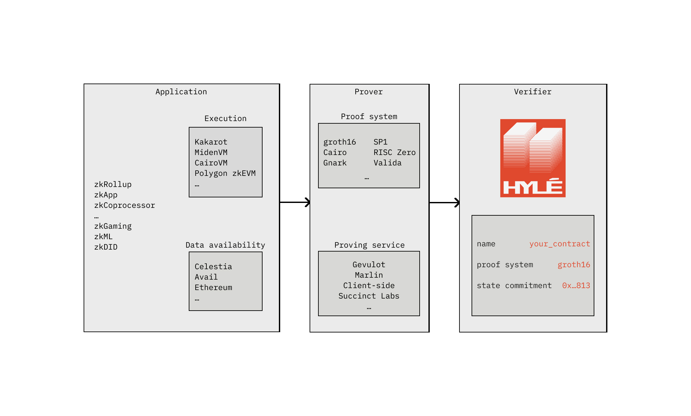

# Introduction to Hylé

[Hylé](https://hyle.eu/) is the new-generation base layer for the era of unchained applications.

## Why choose Hylé

- Native zero-knowledge proof verification on our sovereign L1: we're fast and lean.
- No onchain execution or virtual machine needed: only efficient proof verification.
- Run complex logic off-chain and only submit proofs onchain for maximum scalability.
- Authenticate effortlessly with any identity provider.
- Interoperate with other smart contracts like it’s an API call.
- Pipelined proving: send provable blobs, don't worry about proving times.
- Unlock Web2 speed with a state-of-the-art consensus protocol for DA & settlement.
- Choose your proving scheme and your language: we verify all proofs.

## How Hylé works

Here’s what happens when you use Hylé’s next-generation base layer:

1. **Sequencing**: Send a provable blob of information to Hylé: say what information you expect to prove later. We'll sequence the transaction immediately and give you time to prove it. [Read more about pipelined proving](./concepts/pipelined-proving.md).
1. **Proof submission**: when the proofs for your transaction are ready, send them to Hylé.
1. **Verification**: Hylé validators receive the transaction. They verify the proofs natively, without the limitations of a bulky virtual machine.
1. **Consensus**: if the proofs are valid, Hylé settles your transaction's state onchain. You're good to go!

With this system, execution and storage happen **anywhere you like**. You only need a fast and trustworthy verifier: that’s Hylé.
