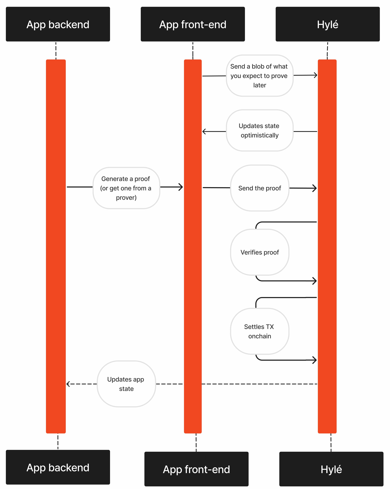

# Introduction to Hylé

[Hylé](https://hyle.eu/) is the new-generation base layer for the era of unchained applications.

An unchained application runs offchain and settles onchain. It benefits from the Web2 user experience and the security of Web3.

## Why choose Hylé

Hylé is built for speed, flexibility, and seamless blockchain integration:

- Ultra-fast ZK verification on a sovereign L1.
- No EVMs, no bottlenecks: run complex logic off-chain, submit a proof, and we’ll verify it natively before settling onchain.
- Frictionless onboarding: authenticate with any identity provider, no wallets required.
- High throughput, low latency with [pipelined proving](./concepts/pipelined-proving.md).
- Choose your tools: use any proving scheme, any language.
- Seamless interoperability: call other contracts with [proof composition](./concepts/proof-composability.md).
- Web2 speed, Web3 security: we use Autobahn consensus for DA & settlement.

## How Hylé works

Here’s what happens when you use Hylé’s next-generation base layer:

1. **Sequencing**: Send a provable blob of information to Hylé: say what information you expect to prove later. We'll sequence the transaction immediately and give you time to prove it. [Read more about pipelined proving](./concepts/pipelined-proving.md).
1. **Proof submission**: when the proofs for your transaction are ready, send them to Hylé.
1. **Verification**: Hylé validators receive the transaction. They verify the proofs natively, without the limitations of a bulky virtual machine.
1. **Consensus**: if the proofs are valid, Hylé settles your transaction's state onchain. You're good to go!

With this system, execution and storage happen **anywhere you like**. You only need a fast and trustworthy verifier: that’s Hylé.
